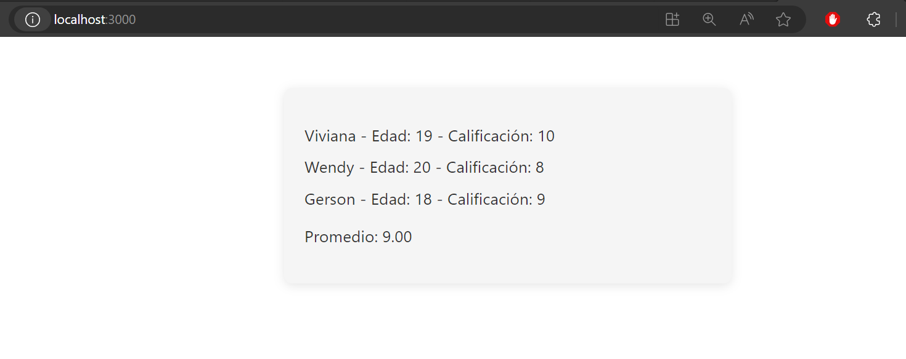

# Ejercicios TypeScript - React

Este repositorio contiene varios proyectos en React con TypeScript que implementan distintos ejercicios y funcionalidades. A continuación, se describen brevemente cada uno de los ejercicios:

### **Select Language:**
- [Español (Spanish)](README-es.md)
- [English](README.md)

## Result
### Calcular el Área del cuadrado
 
### Suma del Arreglo
 
### Dividir arreglo por 5

### Cálculo del Promedio de Calificaciones
 
### Acumulador con Hook useState
 

## 1. Cálculo del Área de un Cuadrado

En el proyecto "calcular-area-cuadrado", se ha implementado una función que permite calcular el área de un cuadrado. El ejercicio se divide en dos componentes: `AreaCuadrado.tsx` para la lógica y `App.tsx` para la vista.

## 2. Suma de Elementos de un Arreglo

El proyecto "arreglo-parametro-suma" presenta una función que recibe un arreglo como parámetro y retorna la suma de sus elementos. Este ejercicio también utiliza TypeScript y React, con componentes separados para la lógica y la vista.

## 3. Nuevo Arreglo con Valores Divididos por 5

En el proyecto "arreglo-devolver-valores", se emplea la función `map` para devolver un nuevo arreglo con los valores del arreglo original divididos por 5.

## 4. Cálculo del Promedio de Calificaciones

El ejercicio "promedio-calificaciones" crea un arreglo con objetos de estudiantes y luego implementa una función para calcular el promedio de sus calificaciones. Se utilizan componentes separados para la lógica y la vista.

## 5. Acumulador con Hook useState

El proyecto "incrementar-disminuir" utiliza el hook `useState` para crear un acumulador de 5. La vista muestra el valor actual del acumulador y dos botones para incrementar y disminuir su valor.

## Instrucciones Generales

1. Cada proyecto tiene su propio directorio con el código fuente y archivos necesarios.
2. Sigue las instrucciones específicas dentro de cada proyecto para ejecutarlos localmente.
3. Asegúrate de tener Node.js y npm instalados para ejecutar proyectos de React.

¡Diviértete explorando y aprendiendo con estos ejercicios en React con TypeScript!
