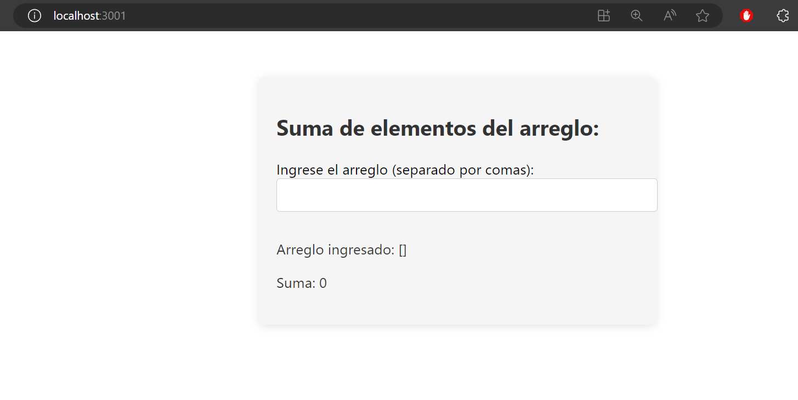
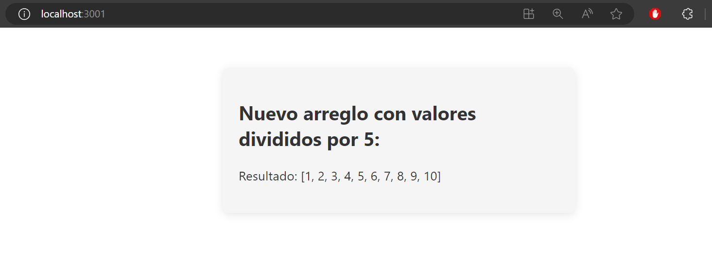
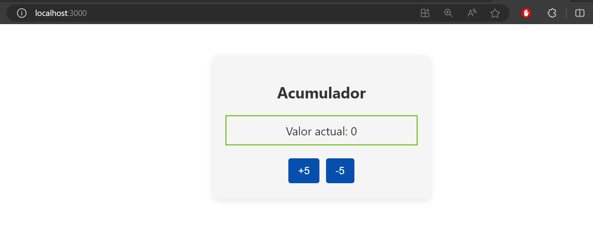

# TypeScript Exercises - React

This repository contains several React projects with TypeScript implementing various exercises and functionalities. Below, each exercise is briefly described:

### **Select Language:**
- [Español (Spanish)](README-es.md)
- [English](README.md)

## Result
### Calculate Square Area
 
### Array Sum
 
### Divide Array by 5

### Calculate Average of Califications
 
### Accumulator with useState Hook
 

## 1. Calculate Square Area

In the "calculate-area-square" project, a function has been implemented to calculate the area of a square. The exercise is divided into two components: `AreaSquare.tsx` for the logic and `App.tsx` for the view.

## 2. Array Sum

The "array-parameter-sum" project introduces a function that receives an array as a parameter and returns the sum of its elements. This exercise also uses TypeScript and React, with separate components for logic and view.

## 3. New Array with Values Divided by 5

In the "array-return-values" project, the `map` function is used to return a new array with values from the original array divided by 5.

## 4. Calculate Average of Califications

The "califications-average" exercise creates an array with student objects and then implements a function to calculate the average of their califications. Separate components are used for logic and view.

## 5. Accumulator with useState Hook

The "increment-decrement" project uses the `useState` hook to create an accumulator of 5. The view displays the current value of the accumulator and two buttons to increment and decrement its value.

## General Instructions

1. Each project has its own directory with source code and necessary files.
2. Follow specific instructions within each project to run them locally.
3. Ensure you have Node.js and npm installed to run React projects.

Enjoy exploring and learning with these TypeScript exercises in React!
